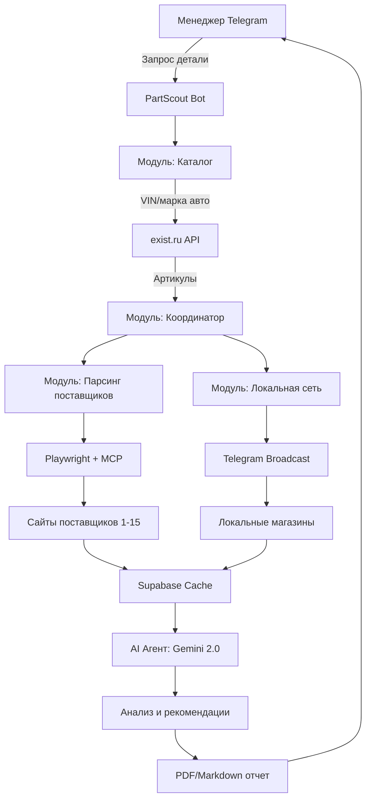

# 🔍 PartScout

> AI-powered автоматизация подбора автозапчастей для автосервисов

[](LICENSE)
[](https://www.python.org/downloads/)
[](https://www.docker.com/)
[](https://ai.google.dev/)
[]()

---

## 📋 Содержание

- [О проекте](#о-проекте)
- [Проблема и решение](#проблема-и-решение)
- [Архитектура](#архитектура)
- [Технологический стек](#технологический-стек)
- [Функциональность](#функциональность)
- [Roadmap](#roadmap)
- [Быстрый старт](#быстрый-старт)
- [Структура проекта](#структура-проекта)
- [Разработка](#разработка)
- [Документация](#документация)
- [Лицензия](#лицензия)

---

## 🎯 О проекте

**PartScout** — система автоматизации подбора автозапчастей с использованием AI-агентов для автосервисов и шиномонтажек.

### Ключевые возможности

- 🤖 **AI-анализ**: Автоматический поиск и сравнение предложений от 10+ поставщиков
- ⚡ **Скорость**: Сокращение времени подбора с 30-40 минут до 2-3 минут
- 💰 **Экономия**: Нахождение оптимальных предложений по цене и срокам
- 🌐 **Локальная сеть**: Интеграция с магазинами в радиусе 60 км для срочных заказов
- 📱 **Telegram-интеграция**: Удобный интерфейс для менеджеров

---

## 🔥 Проблема и решение

### Текущая ситуация

```
Менеджер автосервиса вручную:
├── Определяет нужную деталь по марке авто
├── Открывает 10-15 сайтов поставщиков
├── Сравнивает цены, наличие, сроки доставки
├── Звонит в локальные магазины
└── Тратит 30-40 минут на один запрос
```

**Проблемы:**
- ⏱️ Большие временные затраты
- 😫 Рутинная монотонная работа
- ❌ Человеческий фактор (пропуск выгодных предложений)
- 📉 Невозможность обработать много запросов в день

### Решение PartScout

```
AI-агент автоматически:
├── Определяет точные артикулы через каталоги (exist.ru)
├── Параллельно проверяет все источники
│   ├── Онлайн-поставщики (парсинг/API)
│   └── Локальные магазины (Telegram broadcast)
├── Анализирует предложения с помощью Gemini AI
├── Формирует итоговые рекомендации
└── Отправляет отчет менеджеру в Telegram
```

**Результат:**
- ✅ Время подбора: 2-3 минуты
- ✅ Охват всех доступных источников
- ✅ Обоснованные рекомендации от AI
- ✅ Возможность обработки до 50+ запросов/день

---

## 🏗️ Архитектура

### Общая схема



### Модульная структура

```
┌─────────────────────────────────────────────────────────┐
│                    PARTSCOUT SYSTEM                     │
├─────────────────────────────────────────────────────────┤
│                                                         │
│  ┌──────────────┐  ┌──────────────┐  ┌──────────────┐ │
│  │   Модуль 1   │  │   Модуль 2   │  │   Модуль 3   │ │
│  │   Каталог    │─▶│   Парсинг    │─▶│ AI Аналитик  │ │
│  │              │  │ поставщиков  │  │              │ │
│  └──────────────┘  └──────────────┘  └──────────────┘ │
│         │                  │                  │         │
│         └──────────────────┼──────────────────┘         │
│                            │                            │
│  ┌──────────────┐  ┌───────▼──────┐  ┌──────────────┐ │
│  │   Модуль 4   │  │   Supabase   │  │   Модуль 5   │ │
│  │  Локальная   │─▶│  PostgreSQL  │◀─│  Telegram    │ │
│  │  B2B сеть    │  │   + Storage  │  │     Bot      │ │
│  └──────────────┘  └──────────────┘  └──────────────┘ │
│                                                         │
├─────────────────────────────────────────────────────────┤
│              Orchestration: n8n + MCP                   │
└─────────────────────────────────────────────────────────┘
```

---

## 🛠️ Технологический стек

### Backend

| Компонент | Технология | Назначение |
|-----------|------------|------------|
| **API** | FastAPI | REST API, асинхронные операции |
| **AI/ML** | Google Gemini 2.0 Flash | Анализ данных, рекомендации |
| **Browser Automation** | Playwright + MCP | Парсинг сайтов поставщиков |
| **Web Scraping** | crawl4ai | Быстрый парсинг статического контента |
| **Orchestration** | n8n | Визуальные workflow, автоматизация |
| **Database** | Supabase PostgreSQL | Основное хранилище данных |
| **Cache** | Supabase (TTL queries) | Кэширование цен и наличия |
| **Storage** | Supabase Storage | PDF отчеты, скриншоты |
| **Message Queue** | Celery + Redis | Фоновые задачи (опционально) |

### Messaging & Integration

| Компонент | Технология |
|-----------|------------|
| **Telegram Bot** | aiogram 3.x |
| **MCP Protocol** | Model Context Protocol |
| **Integration** | Google AI Python SDK |

### Infrastructure

| Компонент | Технология |
|-----------|------------|
| **Containerization** | Docker + Docker Compose |
| **Networking** | Cloudflare Tunnel |
| **CI/CD** | GitHub Actions |
| **Monitoring** | Grafana + Prometheus (будущее) |

### Development Tools

```
VS Code Extensions:
├── Continue (MCP client)
├── Cline (AI agent)
├── Gemini Code
├── Qwen Code
└── MCP Inspector
```

---

## ✨ Функциональность

### Phase 1: MVP (текущая разработка)

#### Модуль 1: Каталог деталей
- ✅ Интеграция с exist.ru
- ✅ Определение артикулов по VIN/марке авто
- ✅ Поиск аналогов и кросс-номеров
- ⏳ База популярных деталей

#### Модуль 2: Мониторинг поставщиков
- ✅ Playwright-based парсинг
- ✅ MCP Browser Server
- ⏳ Поддержка 5 основных поставщиков
- ⏳ Гибридная система: БД + real-time парсинг
- ⏳ Кэширование данных (TTL 6 часов)

#### Модуль 3: AI Аналитик
- ✅ Gemini 2.0 Flash для анализа
- ⏳ Сравнение цен, сроков, надежности
- ⏳ Генерация PDF отчетов
- ⏳ Структурированный вывод (JSON + Markdown)

#### Модуль 5: Telegram бот менеджера
- ✅ Базовая структура бота
- ⏳ Команда `/find [деталь]`
- ⏳ Команда `/status [request_id]`
- ⏳ Отправка итоговых отчетов с ссылками

### Phase 2: B2B Локальная сеть

#### Модуль 4: Telegram бот для магазинов
- ⏳ Регистрация локальных магазинов
- ⏳ Broadcast запросов всем магазинам
- ⏳ Агрегация ответов (TTL 5 минут)
- ⏳ Интеграция с основным поиском

**Легенда:** ✅ Готово | ⏳ В разработке | ❌ Не начато

---

## 🗺️ Roadmap

### **Q1 2025: MVP (2-3 месяца)**

#### Milestone 1.1: Инфраструктура ✅
- [x] GitHub репозиторий
- [x] Docker Compose setup
- [x] Supabase подключение
- [x] Cloudflare Tunnel
- [x] n8n развертывание

#### Milestone 1.2: Каталог (2 недели)
- [ ] Парсинг exist.ru
- [ ] API интеграция
- [ ] База данных деталей
- [ ] Поиск по VIN

#### Milestone 1.3: Парсинг (3 недели)
- [ ] Playwright + MCP сервер
- [ ] Интеграция 5 поставщиков
- [ ] Gemini агент для извлечения данных
- [ ] n8n workflow координации

#### Milestone 1.4: AI Анализ (2 недели)
- [ ] Промпт-инжиниринг Gemini
- [ ] Логика сравнения
- [ ] Генерация Markdown отчетов
- [ ] Конвертация в PDF

#### Milestone 1.5: Telegram бот (1 неделя)
- [ ] Базовые команды
- [ ] Отправка отчетов
- [ ] История запросов

**Цель:** Запуск в одном автосервисе, обработка 10-20 запросов/день

---

### **Q2 2025: B2B сеть (3 недели)**

#### Milestone 2.1: Локальные магазины
- [ ] Telegram бот для магазинов
- [ ] Broadcast механизм
- [ ] Агрегация ответов
- [ ] Рейтинговая система

#### Milestone 2.2: Интеграция
- [ ] Объединение онлайн + офлайн результатов
- [ ] Сортировка по скорости получения
- [ ] Аналитика популярных запросов

**Цель:** Подключение 5-10 локальных магазинов

---

### **Q3-Q4 2025: Масштабирование**

- [ ] Multi-tenancy (несколько автосервисов)
- [ ] Мобильное приложение
- [ ] Предиктивная аналитика спроса
- [ ] CRM интеграции
- [ ] Миграция на Kubernetes

---

## 🚀 Быстрый старт

### Требования

- Docker & Docker Compose
- Python 3.11+
- Gemini API ключ ([получить](https://ai.google.dev/))
- Supabase проект ([создать](https://supabase.com))
- Telegram Bot Token ([создать](https://t.me/BotFather))

### Установка

```bash
# Клонировать репозиторий
git clone https://github.com/yourusername/partscout.git
cd partscout

# Копировать .env шаблон
cp .env.example .env

# Заполнить переменные окружения
nano .env
```

### Переменные окружения

```bash
# .env
# Gemini AI
GEMINI_API_KEY=your_gemini_api_key

# Supabase
SUPABASE_URL=https://your-project.supabase.co
SUPABASE_KEY=your_supabase_anon_key
SUPABASE_SERVICE_KEY=your_service_role_key

# Telegram
TELEGRAM_BOT_TOKEN=your_bot_token
TELEGRAM_MANAGER_CHAT_ID=your_chat_id

# n8n
N8N_ENCRYPTION_KEY=your_encryption_key
N8N_HOST=n8n.yourdomain.com

# Cloudflare Tunnel (опционально)
TUNNEL_TOKEN=your_cloudflare_tunnel_token
```

### Запуск

```bash
# Запустить все сервисы
docker-compose up -d

# Проверить статус
docker-compose ps

# Логи
docker-compose logs -f

# Доступ к сервисам:
# n8n: http://localhost:5678
# FastAPI: http://localhost:8000
# API Docs: http://localhost:8000/docs
```

### Первый запрос

```bash
# Через Telegram
/find Масляный фильтр Toyota Camry V50

# Или через API
curl -X POST http://localhost:8000/api/v1/parts/search \
  -H "Content-Type: application/json" \
  -d '{
    "query": "Масляный фильтр",
    "vehicle": {
      "make": "Toyota",
      "model": "Camry",
      "generation": "V50"
    }
  }'
```

---

## 📁 Структура проекта

```
partscout/
├── .github/
│   └── workflows/              # CI/CD
│       ├── ci.yml
│       └── deploy.yml
│
├── docs/                       # Документация
│   ├── architecture.md
│   ├── api.md
│   ├── deployment.md
│   └── prompts/                # AI промпты
│       ├── parser.md
│       ├── analyzer.md
│       └── reporter.md
│
├── services/                   # Микросервисы
│   ├── catalog/                # Модуль 1: Каталог
│   │   ├── Dockerfile
│   │   ├── main.py
│   │   ├── exist_parser.py
│   │   └── requirements.txt
│   │
│   ├── scraper/                # Модуль 2: Парсинг
│   │   ├── Dockerfile
│   │   ├── main.py
│   │   ├── playwright_mcp.py
│   │   ├── providers/
│   │   │   ├── provider_a.py
│   │   │   └── provider_b.py
│   │   └── requirements.txt
│   │
│   ├── ai-agent/               # Модуль 3: AI
│   │   ├── Dockerfile
│   │   ├── main.py
│   │   ├── gemini_client.py
│   │   ├── analyzer.py
│   │   ├── reporter.py
│   │   └── requirements.txt
│   │
│   ├── b2b-bot/                # Модуль 4: B2B
│   │   ├── Dockerfile
│   │   ├── main.py
│   │   ├── broadcast.py
│   │   └── requirements.txt
│   │
│   └── manager-bot/            # Модуль 5: Telegram менеджера
│       ├── Dockerfile
│       ├── main.py
│       ├── handlers/
│       │   ├── search.py
│       │   └── status.py
│       └── requirements.txt
│
├── shared/                     # Общие утилиты
│   ├── database/
│   │   ├── models.py
│   │   └── supabase_client.py
│   ├── mcp/
│   │   ├── browser_server.py
│   │   ├── db_server.py
│   │   └── fs_server.py
│   └── utils/
│       ├── logger.py
│       └── validators.py
│
├── infrastructure/             # Инфраструктура
│   ├── docker/
│   │   ├── Dockerfile.base
│   │   └── docker-compose.yml
│   ├── cloudflare/
│   │   └── tunnel-config.yml
│   └── kubernetes/             # Будущее
│       ├── deployment.yaml
│       └── service.yaml
│
├── n8n-workflows/              # n8n workflows
│   ├── main-search-flow.json
│   ├── b2b-broadcast.json
│   └── cache-updater.json
│
├── scripts/                    # Утилиты
│   ├── setup.sh
│   ├── migrate.sh
│   └── seed_data.py
│
├── tests/                      # Тесты
│   ├── unit/
│   ├── integration/
│   └── e2e/
│
├── .env.example                # Шаблон переменных
├── .gitignore
├── docker-compose.yml          # Основной compose
├── LICENSE
├── Makefile                    # Команды разработки
└── README.md
```

---

## 🔧 Разработка

### Локальная разработка

```bash
# Создать виртуальное окружение
python -m venv venv
source venv/bin/activate  # Linux/Mac
# или
venv\Scripts\activate     # Windows

# Установить зависимости
pip install -r requirements-dev.txt

# Запустить в режиме разработки
make dev

# Запустить тесты
make test

# Линтинг
make lint

# Форматирование
make format
```

### MCP Разработка

```bash
# Создать новый MCP сервер
python scripts/create_mcp_server.py --name my-server

# Тестировать MCP сервер
mcp dev services/scraper/mcp_server.py

# Отладка в VS Code
# Используйте MCP Inspector extension
```

### n8n Workflows

```bash
# Экспорт workflow
n8n export:workflow --id=1 --output=n8n-workflows/

# Импорт workflow
n8n import:workflow --input=n8n-workflows/main-search-flow.json

# Запуск workflow из CLI
n8n execute --id=1
```

### База данных

```bash
# Применить миграции
make migrate

# Откатить миграцию
make migrate-down

# Создать новую миграцию
make migration name=add_shops_table

# Заполнить тестовыми данными
make seed
```

---

## 📚 Документация

### API Documentation

Автоматическая документация доступна после запуска:

- **Swagger UI**: http://localhost:8000/docs
- **ReDoc**: http://localhost:8000/redoc

### Дополнительная документация

- [Архитектура системы](docs/architecture.md)
- [API Reference](docs/api.md)
- [Deployment Guide](docs/deployment.md)
- [AI Prompts](docs/prompts/)
- [Contributing Guidelines](CONTRIBUTING.md)

---

## 🤝 Вклад в проект

Мы приветствуем вклад в проект! Пожалуйста, ознакомьтесь с [CONTRIBUTING.md](CONTRIBUTING.md)

### Процесс разработки

1. Fork репозитория
2. Создайте feature branch (`git checkout -b feature/amazing-feature`)
3. Commit изменения (`git commit -m 'Add amazing feature'`)
4. Push в branch (`git push origin feature/amazing-feature`)
5. Откройте Pull Request

---

## 📊 Метрики и мониторинг

### Ключевые метрики MVP

| Метрика | Цель | Текущий статус |
|---------|------|----------------|
| Время подбора | < 3 мин | ⏳ В разработке |
| Точность артикулов | > 90% | ⏳ В разработке |
| Охват поставщиков | 5-10 | ⏳ В разработке |
| Доступность системы | > 95% | ⏳ В разработке |

---

## 🐛 Известные проблемы

- [ ] Некоторые поставщики требуют авторизации (решение: ScrapingBee API)
- [ ] Captcha на защищенных сайтах (решение: 2captcha интеграция)
- [ ] Rate limiting при частых запросах (решение: прокси ротация)

См. полный список в [Issues](https://github.com/yourusername/partscout/issues)

---

## 📝 Changelog

### [0.1.0] - 2025-01-XX (Planned)

#### Added
- Базовая инфраструктура (Docker, Supabase, n8n)
- Модуль каталога (exist.ru интеграция)
- Парсинг 5 основных поставщиков
- AI анализ на Gemini 2.0 Flash
- Telegram бот для менеджера

#### Changed
- N/A

#### Fixed
- N/A

---

## 📄 Лицензия

Этот проект лицензирован под [MIT License](LICENSE).

---

## 👥 Команда

- **Архитектор проекта**: Kalina
- **AI Консультант**: Claude + Gemini

---

## 🙏 Благодарности

- [Anthropic](https://anthropic.com) - MCP Protocol
- [Google](https://ai.google.dev/) - Gemini API
- [n8n](https://n8n.io) - Workflow automation
- [Supabase](https://supabase.com) - Backend as a Service
- [Playwright](https://playwright.dev) - Browser automation

---

## 📞 Контакты

- **Email**: kalinofff@mail.ru
- **Telegram**: [@yourusername](https://t.me/andrey_kalinau)
- **Issues**: [GitHub Issues](https://github.com/avkus/partscout/issues)

---

<div align="center">

**[⬆ Наверх](#-partscout)**

Сделано с ❤️ и AI

</div>
